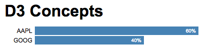

d3-concepts
===========

Modify the render() function in main.js to render a portfolio. The portfolio consists of holdings along with
their percent allocations. For example:

    var portfolio = [
        { symbol: 'AAPL', allocation: 60 },
        { symbol: 'GOOG', allocation: 40 }
    ];

- Each holding should be drawn as a horizontal bar with its width representing the allocation percentage.
- The bar should have a label on the left showing the symbol.
- The bar should show the allocation percentage right-justified inside the rectangle.
- Holdings should be displayed alphabetically by symbol, even if the portfolio supplied is not sorted alphabetically.
- Use SVG to render the chart (don't use divs).

See below for a sample:

The render function should be written in such a way that it can be called repeatedly whenever the portfolio
changes. This should update the bar chart in an optimal way:

- New holdings should be created from scratch
- Existing holdings should be simply updated (no new DOM elements should be created)
- Deleted holdings should be removed

Use D3 transitions animate the changes.